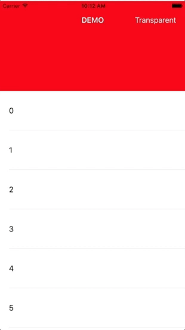

### LCStretchableHeaderViewController

#### 功能介绍
 *    提供一个UIViewController的子类LCStretchableHeaderViewController，支持设置stretchableHeader，实现下拉的时候，header放大，类似于qq空间的效果
 *   支持向上滑动，导航栏的颜色渐变效果

------------------
#### 如何使用
* pod "LCStretchableHeaderViewController" 
* 使用代码示例：

``` swift
- (void)viewDidLoad
{
    [super viewDidLoad];
    // Do any additional setup after loading the view.
    [self setupUI];
}
- (void)setupUI
{
    self.view.backgroundColor = [UIColor whiteColor];
    self.title = @"DEMO";
    self.navBarNormalColor = [UIColor greenColor];
    self.ignoredTopOffset = 200;
    
    //add subview
    self.headerView = [[UIView alloc] initWithFrame:CGRectMake(0, 0, [UIScreen mainScreen].bounds.size.width, 200)];
    self.headerView.backgroundColor = [UIColor redColor];
    //set frame
    UITableView *tableView = [[UITableView alloc] initWithFrame:CGRectMake(0, 0, [UIScreen mainScreen].bounds.size.width, [UIScreen mainScreen].bounds.size.height) style:UITableViewStyleGrouped];
    tableView.rowHeight = 88;
    tableView.delegate = self;
    tableView.dataSource = self;
    self.containerView = tableView;
}

```
#### 效果截图



